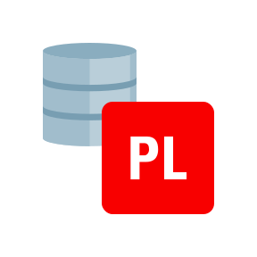
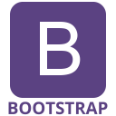

### Hi there! 

I'm a young software developer, ENFJ-A personality, graphic designer, christian, passionate to gaming and always up for a good challenge!

- 👨‍💻 I’m currently working as an Integration Analyst at [GTPlan](https://gtplantech.com/).
- 🎓 Graduated in Computer Science at Instituto Federal de Brasília (IFB).
- 🔭 I’m currently working on a project in PHP 8 alongside with Laravel.
- 🌱 Very interested in exploring new concepts about data analysis.
- 📌 I live in Brasília, Brazil 🇧🇷
- 💬 Ask me about anything, I'm happy to help.

📫 How to reach me:
------------

  
  
  

Favorite Technologies
------------

<h3>I've been using on a daily basis:</h3>

------------
<h3>Used in my previous projects</h3>

------------
<h3>I'm very enthusiast about</h3>

